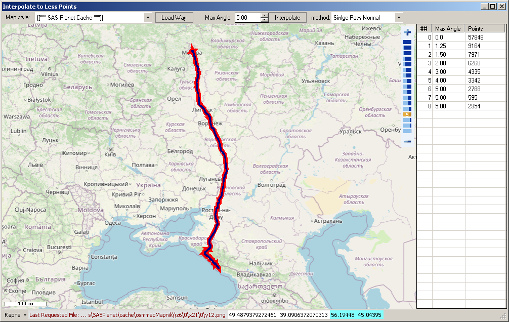

# IntepolateTrack2LessPoints

Interpolate kml/gpx/shp track/route/polyline to less points.     
Support Tile Maps & SAS.Planet Cache.

Прореживание точек трека kmz/gpx/shp до меньшего количества точек.    
Поддерживает тайловые карты и кэш SAS.Планета

More Utilites for KMZ/KML/GPX files:    
[KMZRebuilder](https://github.com/dkxce/KMZRebuilder)     
[KMZViewer](https://github.com/dkxce/KMZViewer)     
[KMZPOIfromOSM](https://github.com/dkxce/KMZPOIfromOSM)     

